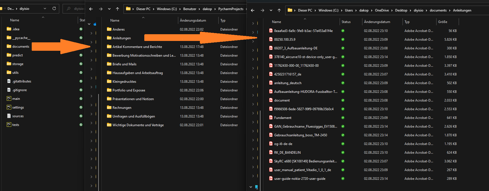

# diyisio
Mit diyisio, gesprochen di-ei-weisio (ˌdiː aɪ ˈwaɪ zi̯o), ist es einfacher als je zuvor möglich, einen auf die eigenen Anforderungen abgestimmten Dokumentklassifikator zu trainieren und benutzen.
Dabei stellt das Tool gleich zwei Stand der Technik Klassifikatoren zur Verfügung, welche unglaublich gute Ergebnisse erzielen (nahe 100%).

Mit diyisio ist es möglich, sowohl PDFs (`.pdf`), als auch Microsoft Word (`.docx`) Dokumente zuverlässig zu klassifizieren.


## Konzept
Bevor wir zur Installation kommen, ist es wichtig das Tool zu verstehen:

### Klassifikatoren
> Welche Klassifikatoren gibt es, warum und worin unterscheiden sie sich?
> > Zur Auswahl stehen:
> > * Voting Classifier (inkl. Support-Vector-Classification, Naive Bayers Classifier & ein Random Forest Classifier)
> > * Doc2Vec (beruht auf Google's Word2Vec, das Wörter mit Kontext als Vektoren darstellen kann)

> > Während der Voting Classifier bei wenigen Trainingsdaten (weniger als ~30 000 Wörter) sehr gut abschneidet, wird Doc2Vec mit jedem Wort besser und überholt den Voting Classifier.

> > Daher sind beide Klassifikatoren essenziell für eine flexible Anwendung, die für variable Anzahl an Trainingsdaten verwendet werden kann.

> > Auf technischer Ebene unterscheiden sich die beiden Klassifikatoren stark: Während die Klassifikatoren des Voting Classifiers (beruhend auf dem Prinzip Teamwork makes the Dreamwork
> > die unterschiedlichen Klassifikatoren gleichen jeweils ihre individuellen Schwächen aus) nur die Wortanzahl (bzw. durch N-grams kleine Satzschnipsel) zählen, ist der Ansatz von Doc2Vec komplexer.
> > Doc2Vec nutzt die Trainingsdaten (kann übrigens auch mit anderen Daten trainiert werden, um die Sprache zu "lernen"), um die Wörter im Kontext als Vektoren darzustellen. Durch den Kontext versteht
> > Doc2Vec die Bedeutung und eventuelle Attribute (weiblich/männlich, Plural, Komparation) des Wortes besser. Aus dem Dokument (bzw. wie später erklärt wird: aus den Dokumentabschnitten) wird ein Vektor
> > erzeugt, der über Logicistic Regression (LRC) einfach klassifiziert werden kann.


### Dateiverzeichnis
Nicht ohne Grund hat diyisio DIY im Namen: Ein grundlegendes Ziel ist es, die Verwendung der KI so einfach und intuitiv wie möglich zu gestalten, sodass auch Nutzer:innen ohne Programmiererfahrung das Tool vom Source-Code nutzen können:


#### Training
Die Klassenzuweisung findet per Windows-Ordner statt: in dem Ordner `documents` können beliebig viele Ordner erstellt werden, die die Klassennamen tragen. In diesen Unterordnern dürfen beliebig viele weitere Unterordner sein und/oder Dokumente selbst.
So könnte ein Dateiverzeichnis für einen Klassifikator, der zwischen `Schule`, den jeweiligen Fächern und `Freizeit` unterscheidet so aussehen:
```
documents/
├─ Freizeit/
│  ├─ Vereinsaufnahme.docx
│  ├─ Urlaubsplanung.docx
│  ├─ Foto.png (kein Dokument --> ignoriert)
├─ Schule/
│  ├─ Zeugnis.pdf
│  ├─ Zertifikat.pdf
│  ├─ Mathe/
│  │  ├─ Hausaufgabe.pdf
│  ├─ Deutsch/
│  │  ├─ Präsentationsnotiz.docx
│  │  ├─ Hausaufgabe.pdf (gleicher Name wie woanders ist erlaubt)
│  ├─ Biologie/
│  │  ├─ [Leer --> ignoriert]
│  ├─ Informatik/
│  │  ├─ Wettbewerbe.docx
│  │  ├─ Unterrichtsnotiz.pdf
├─ .../
```
So werden die Klassen `Freizeit`, `Schule`, `Mathe`, `Deutsch` und `Informatik` erstellt. Gleichzeitig werden den Klassen die jeweiligen Dokumente zugewiesen:

| Freizeit             | Schule      | Mathe           | Deutsch                | Informatik           |
|----------------------|-------------|-----------------|------------------------|----------------------|
| Vereinsaufnahme.docx | Zeugnis.pdf | Hausaufgabe.pdf | Präsentationsnotiz.pdf | Wettbewerbe.docx     |
| Urlaubsplanung.docx  | Zertifikat  |                 | Hausaufgabe.pdf        | Unterrichtsnotiz.pdf |

(Dient nur zur Demo, eigentlich werden alle Dateien zusammen in ein pandas Dataframe mit der zugehörigen Kategorie gespeichert)

Der/die Nutzer:in kann einfach Klassen nach Belieben erstellen, ohne sich über den technischen Hintergrund (z.B.: Labelencoding) zu sorgen.

#### Prediction
Bei der Prediction gibt es natürlich keine Unterordner, dort werden alle Dateien, die direkt im Ordner `predict/` sind, an das Modell geleitet.


### Starten des Trainings / der Prediction
Hierfür war eigentlich ein Command Line Interface geplant, allerdings widerspricht das dem Gedanken der simplen Benutzung.
Daher habe ich mich *(mehrere anstrengende Nächte; bitte hab Verständnis für unordentlichen Code in diesem Abschnitt)* hingesetzt, und ein simples Flask Interface dafür programmiert.


#### Starten der Flask Applikation
Hierfür muss die Datei `flask-gui.py` ausgeführt werden. Keine Angst, das wird bei der Installation nochmal ausführlich erläutert.

#### Training


1. Die Flask Application läuft auf dem localhost (127.0.0.1)
2. Über den (immer als aktiv gezeigten) Kippschalter, kann zwischen `Predict Data` und `Train Classifier` gewechselt werden.
3. Beim Training stehen die beiden Modelle (siehe "Klassifikatoren") zur Auswahl. Eine weitere Option "auto" ist geplant und befindet sich in der Entwicklung (dazu später mehr).
4. Train final sollte aktiviert werden, wenn alle verfügbaren Daten fürs Training verwendet werden sollen (also keine fürs Testen). Dies ist ratsam, wenn das Modell schon getestet wurde, um beste Ergebnisse zu erzielen.
5. Um zu schauen, ob das Modell richtig funktioniert lohnt es sich Train once zu aktivieren. Normalerweise werden über StratifiedKFold mehrere Modelle trainiert und getestet, um eine genauere Accuracy zu erhalten. Allerdings dauert es länger, wenn diese Option deaktiviert ist.
6. Um mehrere Modelle des gleichen Classifiers zu speichern, benutze einen Custom name suffix. Dieser wird bei der Prediction angezeigt. Falls das Modell nicht gespeichert werden soll, deaktiviere Save to disk.
7. Für den Classifier Doc2Vec ist es möglich, die Anzahl der Epochs (Iterationen über den Wortschatz) zu bestimmen. Diese Option kann auch freigelassen werden, falls der andere Classifier verwendet wird, oder 100 (empfohlen) genutzt werden soll.
8. Hier können die Dateien eingesehen werden, die zum Training verwendet werden. Dafür einmal auf `Files:` drücken.
9. Zu guter letzt kann der Trainingsvorgang durch einen Klick auf "Train" gestartet werden.

#### Prediction 


0. (Die Predict Seite ist gleich aufgebaut, es wird nicht alles doppelt erläutert)
1. Hier kann, falls schon trainiert, ein Modell ausgewählt werden. Ist eins mit einem Custom name suffix trainiert worden, erscheint dieser nach dem Classifier z.B.: `[Doc2Vec] Name`.
2. Wer an den einzelnen Wahrscheinlichkeiten je Kategorie interessiert ist, aktiviert diese Option. Sie werden ausschließlich in der Console angezeigt.


#### Restart, restart, restart...
Wie anfangs erwähnt bin ich nicht sonderlich stolz auf den Flask Wrapper der Applikation. Das liegt zum einen an der Code-Qualität, vor allem aber am Aufbau:
Nachdem einmal auf Predict oder Train gedrückt wird, wird die Konfiguration als Systemvariablen initialisiert, welche vom nächsten Programm gelesen werden.
Sprich für jede neue Prediction oder Training muss **das Flask Programm neu gestartet werden**. Das kommt davon, einen Misch-Styl von Python-Django und Systemvariablen zu verwenden.

Auch hier habe ich einen Ansatz für einen recht simplen Fix (siehe `FUTURE.md`), allerdings bis zum Ende des Wettbewerbs noch keine Zeit gefunden.


#### Erweitere Konfiguration
Es kann nicht alles in der Flask Applikation eingestellt werden. Erweiterte Einstellungen erfordern Änderungen in der `settingy.py` Datei, funktionieren aber genauso.
Nicht einstellbar in Flask sind:
* Ordnernamen (z.B.: `documents/`)
* Text Preprocessing (Lemmatisierung (empfohlen), Stemmen oder nichts)
* Maximale Anzahl an Wörter in einem Dokument, bevor es gesplittet wird (dazu später mehr)
* CV_SPLITS, diese sind in `settings.py` dynamsich programmiert

Es kann auch manuell getestet werden (siehe `tests.py`), also ohne den Flask Wrapper. Hierfür können die anderen Einstellungen natürlich auch verändert werden:
Das zweite Element ("default") `os.environ.get(name, default)` kann hierfür verändert werden.


### Innovativer Umgang mit unterschiedlich langen Dokumenten
Ein Highlight von diyisio ist, dass es mit unterschiedlich langen Dokumenten erstklassig umgehen kann. Hierfür zerlegt es das Dokument in 500 Wörter Abschnitte und predicted jeden einzelnen. Am Ende werden die Predictions zusammengeführt zu einem Gesamtergebnis.
Natürlich werden 510 Wörter nicht in 500 und 10 Wörter, sondern in 2x 255 Wörter zerlegt.

### Genauigkeit
Bei 7 Klassen trainiert mit jeweils 20-30 Dokumenten à ~400-1500 Wörtern (100 Epochs) erzielt das Doc2Vec Modell eine sehr hohe Genauigkeit. Die exakte Genauigkeit hängt von der Wortanzahl ab und kann **näherungsweise** über folgende Formel berechnet werden:
`p = (0.025)^x` wobei `x` die Anzahl an 500 Wortabschitten ist. Dabei entsprechen 500 Wörter ungefähr 1,5 Seiten.

| Klassifikator     | 500 Wörter | 1000 Wörter | 1500 Wörter | 2000 Wörter |
|-------------------|------------|-------------|-------------|-------------|
| Doc2Vec           | ~97,5%     | ~99,93%     | ~99,998%    | ~99,9999%   |
| Voting Classifier | ~90,4%     | ~99,07%     | ~99,912%    | ~99,9915%   |

Genauigkeiten der Klassifikatoren je nach Dokumentenlänge mit den oben beschriebenen Trainingsbedingungen trainiert. Bei einem Dokument von mindestens 2000 Wörtern liegt die Wahrscheinlichkeit für eine Fehlklassifikation bei ~1:1 Million.


## Installation
So, genug von der langweiligen Theorie, nun kommt die Praxis und das Training eines eigenen Dokumentklassifikators:
