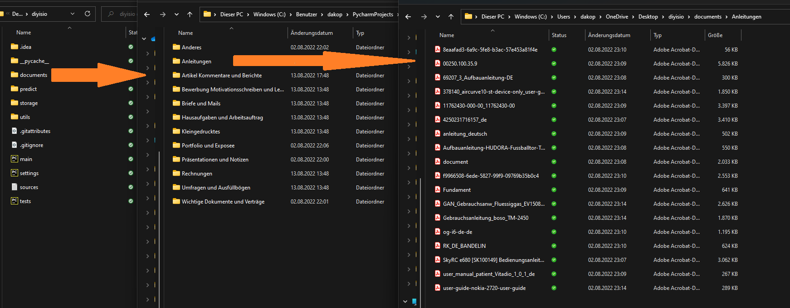

# diyisio
Mit diyisio, gesprochen di-ei-weisio (ˌdiː aɪ ˈwaɪ zi̯o), ist es einfacher als je zuvor möglich, einen auf die eigenen Anforderungen abgestimmten Dokumentklassifikator zu trainieren und benutzen.
Dabei stellt das Tool gleich zwei Stand der Technik Klassifikatoren zur Verfügung, welche unglaublich gute Ergebnisse erzielen (nahe 100%).

Mit diyisio ist es möglich, sowohl PDFs (`.pdf`), als auch Microsoft Word (`.docx`) Dokumente zuverlässig zu klassifizieren. diyisio ist der erste Dokument-Klassifikator, der für Laien entwickelt wurde.


## Konzept
Bevor wir zur Installation kommen, ist es wichtig das Tool zu verstehen:

### Klassifikatoren
> Welche Klassifikatoren gibt es, warum und worin unterscheiden sie sich?
> > Zur Auswahl stehen:
> > * Voting Classifier (inkl. Support-Vector-Classification, Naive Bayers Classifier & ein Random Forest Classifier)
> > * Doc2Vec (beruht auf Google's Word2Vec, das Wörter mit Kontext als Vektoren darstellen kann)

> > Während der Voting Classifier bei wenigen Trainingsdaten (weniger als ~30 000 Wörter) sehr gut abschneidet, wird Doc2Vec mit jedem Wort besser und überholt den Voting Classifier.

> > Daher sind beide Klassifikatoren essenziell für eine flexible Anwendung, die für variable Anzahl an Trainingsdaten verwendet werden kann.

> > Auf technischer Ebene unterscheiden sich die beiden Klassifikatoren stark: Während die Klassifikatoren des Voting Classifiers (beruhend auf dem Prinzip Teamwork makes the Dreamwork
> > die unterschiedlichen Klassifikatoren gleichen jeweils ihre individuellen Schwächen aus) nur die Wortanzahl (bzw. durch N-grams kleine Satzschnipsel) zählen, ist der Ansatz von Doc2Vec komplexer.
> > Doc2Vec nutzt die Trainingsdaten (kann übrigens auch mit anderen Daten trainiert werden, um die Sprache zu "lernen"), um die Wörter im Kontext als Vektoren darzustellen. Durch den Kontext versteht
> > Doc2Vec die Bedeutung und eventuelle Attribute (weiblich/männlich, Plural, Komparation) des Wortes besser. Aus dem Dokument (bzw. wie später erklärt wird: aus den Dokumentabschnitten) wird ein Vektor
> > erzeugt, der über Logicistic Regression (LRC) einfach klassifiziert werden kann.


### Dateiverzeichnis
Nicht ohne Grund hat diyisio DIY im Namen: Ein grundlegendes Ziel ist es, die Verwendung der KI so einfach und intuitiv wie möglich zu gestalten, sodass auch Nutzer:innen ohne Programmiererfahrung das Tool vom Source-Code nutzen können:


#### Training
Die Klassenzuweisung findet per Windows-Ordner statt: in dem Ordner `documents` können beliebig viele Ordner erstellt werden, die die Klassennamen tragen. In diesen Unterordnern dürfen beliebig viele weitere Unterordner sein und/oder Dokumente selbst.
So könnte ein Dateiverzeichnis für einen Klassifikator, der zwischen `Schule`, den jeweiligen Fächern und `Freizeit` unterscheidet so aussehen:
```
documents/
├─ Freizeit/
│  ├─ Vereinsaufnahme.docx
│  ├─ Urlaubsplanung.docx
│  ├─ Foto.png (kein Dokument --> ignoriert)
├─ Schule/
│  ├─ Zeugnis.pdf
│  ├─ Zertifikat.pdf
│  ├─ Mathe/
│  │  ├─ Hausaufgabe.pdf
│  ├─ Deutsch/
│  │  ├─ Präsentationsnotiz.docx
│  │  ├─ Hausaufgabe.pdf (gleicher Name wie woanders ist erlaubt)
│  ├─ Biologie/
│  │  ├─ [Leer --> ignoriert]
│  ├─ Informatik/
│  │  ├─ Wettbewerbe.docx
│  │  ├─ Unterrichtsnotiz.pdf
├─ .../
```
So werden die Klassen `Freizeit`, `Schule`, `Mathe`, `Deutsch` und `Informatik` erstellt. Gleichzeitig werden den Klassen die jeweiligen Dokumente zugewiesen:

| Freizeit             | Schule      | Mathe           | Deutsch                | Informatik           |
|----------------------|-------------|-----------------|------------------------|----------------------|
| Vereinsaufnahme.docx | Zeugnis.pdf | Hausaufgabe.pdf | Präsentationsnotiz.pdf | Wettbewerbe.docx     |
| Urlaubsplanung.docx  | Zertifikat  |                 | Hausaufgabe.pdf        | Unterrichtsnotiz.pdf |

(Dient nur zur Demo, eigentlich werden alle Dateien zusammen in ein pandas Dataframe mit der zugehörigen Kategorie gespeichert)

Der/die Nutzer:in kann einfach Klassen nach Belieben erstellen, ohne sich über den technischen Hintergrund (z.B.: Labelencoding) zu sorgen.

#### Prediction
Bei der Prediction gibt es natürlich keine Unterordner, dort werden alle Dateien, die direkt im Ordner `predict/` sind, an das Modell geleitet.


### Starten des Trainings / der Prediction
Hierfür war eigentlich ein Command Line Interface geplant, allerdings widerspricht das dem Gedanken der simplen Benutzung.
Daher habe ich mich *(mehrere anstrengende Nächte; bitte hab Verständnis für unordentlichen Code in diesem Abschnitt)* hingesetzt, und ein simples Flask Interface dafür programmiert.


#### Starten der Flask Applikation
Hierfür muss die Datei `flask-gui.py` ausgeführt werden. Keine Angst, das wird bei der Installation nochmal ausführlich erläutert.

#### Training


1. Die Flask Application läuft auf dem localhost (127.0.0.1)
2. Über den (immer als aktiv gezeigten) Kippschalter, kann zwischen `Predict Data` und `Train Classifier` gewechselt werden.
3. Beim Training stehen die beiden Modelle (siehe "Klassifikatoren") zur Auswahl. Eine weitere Option "auto" ist geplant und befindet sich in der Entwicklung (dazu später mehr).
4. Train final sollte aktiviert werden, wenn alle verfügbaren Daten fürs Training verwendet werden sollen (also keine fürs Testen). Dies ist ratsam, wenn das Modell schon getestet wurde, um beste Ergebnisse zu erzielen.
5. Um zu schauen, ob das Modell richtig funktioniert lohnt es sich Train once zu aktivieren. Normalerweise werden über StratifiedKFold mehrere Modelle trainiert und getestet, um eine genauere Accuracy zu erhalten. Allerdings dauert es länger, wenn diese Option deaktiviert ist.
6. Um mehrere Modelle des gleichen Classifiers zu speichern, benutze einen Custom name suffix. Dieser wird bei der Prediction angezeigt. Falls das Modell nicht gespeichert werden soll, deaktiviere Save to disk.
7. Für den Classifier Doc2Vec ist es möglich, die Anzahl der Epochs (Iterationen über den Wortschatz) zu bestimmen. Diese Option kann auch freigelassen werden, falls der andere Classifier verwendet wird, oder 100 (empfohlen) genutzt werden soll.
8. Hier können die Dateien eingesehen werden, die zum Training verwendet werden. Dafür einmal auf `Files:` drücken.
9. Zu guter letzt kann der Trainingsvorgang durch einen Klick auf "Train" gestartet werden.

#### Prediction 


0. (Die Predict Seite ist gleich aufgebaut, es wird nicht alles doppelt erläutert)
1. Hier kann, falls schon trainiert, ein Modell ausgewählt werden. Ist eins mit einem Custom name suffix trainiert worden, erscheint dieser nach dem Classifier z.B.: `[Doc2Vec] Name`.
2. Wer an den einzelnen Wahrscheinlichkeiten je Kategorie interessiert ist, aktiviert diese Option. Sie werden ausschließlich in der Console angezeigt.


#### Restart, restart, restart...
Wie anfangs erwähnt bin ich nicht sonderlich stolz auf den Flask Wrapper der Applikation. Das liegt zum einen an der Code-Qualität, vor allem aber am Aufbau:
Nachdem einmal auf Predict oder Train gedrückt wird, wird die Konfiguration als Systemvariablen initialisiert, welche vom nächsten Programm gelesen werden.
Sprich für jede neue Prediction oder Training muss **das Flask Programm neu gestartet werden**. Das kommt davon, einen Misch-Styl von Python-Django und Systemvariablen zu verwenden.

Auch hier habe ich einen Ansatz für einen recht simplen Fix (siehe `FUTURE.md`), allerdings bis zum Ende des Wettbewerbs noch keine Zeit gefunden.


#### Erweitere Konfiguration
Es kann nicht alles in der Flask Applikation eingestellt werden. Erweiterte Einstellungen erfordern Änderungen in der `settingy.py` Datei, funktionieren aber genauso.
Nicht einstellbar in Flask sind:
* Ordnernamen (z.B.: `documents/`)
* Text Preprocessing (Lemmatisierung (empfohlen), Stemmen oder nichts)
* Maximale Anzahl an Wörter in einem Dokument, bevor es gesplittet wird (dazu später mehr)
* CV_SPLITS, diese sind in `settings.py` dynamsich programmiert

Es kann auch manuell getestet werden (siehe `tests.py`), also ohne den Flask Wrapper. Hierfür können die anderen Einstellungen natürlich auch verändert werden:
Das zweite Element ("default") `os.environ.get(name, default)` kann hierfür verändert werden.


### Innovativer Umgang mit unterschiedlich langen Dokumenten
Ein Highlight von diyisio ist, dass es mit unterschiedlich langen Dokumenten erstklassig umgehen kann. Hierfür zerlegt es das Dokument in 500 Wörter Abschnitte und predicted jeden einzelnen. Am Ende werden die Predictions zusammengeführt zu einem Gesamtergebnis.
Natürlich werden 510 Wörter nicht in 500 und 10 Wörter, sondern in 2x 255 Wörter zerlegt.

### Genauigkeit
Bei 7 Klassen trainiert mit jeweils 20-30 Dokumenten à ~400-1500 Wörtern (100 Epochs) erzielt das Doc2Vec Modell eine sehr hohe Genauigkeit. Die exakte Genauigkeit hängt von der Wortanzahl ab und kann **näherungsweise** über folgende Formel berechnet werden:
`p = (0.025)^x` wobei `x` die Anzahl an 500 Wortabschitten ist. Dabei entsprechen 500 Wörter ungefähr 1,5 Seiten.

| Klassifikator     | 500 Wörter | 1000 Wörter | 1500 Wörter | 2000 Wörter |
|-------------------|------------|-------------|-------------|-------------|
| Doc2Vec           | ~94,1%     | ~99,65%     | ~99,98%     | ~99,999%    |
| Voting Classifier | ~90,8%     | ~99,15%     | ~99,92%     | ~99,993%    |

Genauigkeiten der Klassifikatoren je nach Dokumentenlänge mit den oben beschriebenen Trainingsbedingungen trainiert. Bei einem Dokument von mindestens 2000 Wörtern liegt die Wahrscheinlichkeit für eine Fehlklassifikation bei ~1:100 000.


## Installation
So, genug von der Theorie, nun kommt die Praxis und das Training eines eigenen Dokumentklassifikators:

### Systemanforderungen
* Windows (11 getestet, sollte auf 10 genauso funktionieren), für Linux und MacOS müsste die Extrahierung und das Ordnersystem umgeschrieben werden.
* Python Version: `3.10` (auf älteren Versionen ungetestet)
* Speicher: Alleine die Dependencies benötigen ca. 1 GB Speicher (aufgrund des SpaCy lemmatization Datensatzes; kann um 500mb reduziert werden, indem `de_core_news_lg` aus `requirements.txt` genommen wird und der Code angepasst wird (siehe Kommentar in `utils/preprocessing.py`).
* Sonstige Anforderungen:
  * Eine möglichst neue CPU wird empfohlen, da darauf die KI trainiert wird. Es ist derzeit nicht möglich (und da das Training schnell geht auch nicht erforderlich), das Modell auf einer Grafikkarte zu trainieren. 

### Installation Step-by-Step
1. [Git **l**arge **f**ile **s**torage](https://git-lfs.github.com/) installieren (und `git lfs install` ausführen, wie in der Anleitung beschrieben). Git lfs wird verwendet, um die AI-Modelle auf GitHub zu laden, ohne ihre Versionsgeschichte mitzuspeichern.
2. Projekt klonen
3. Dependencies installieren (Befehl `pip install -r requirements.txt` ausführen). Sollte word-stemming (nltk SnowballStemmer) statt der empfohlenen lemmatization gewünscht sein, muss diese im Code einmal installiert werden über den zugehörigen `nltk.download()` Befehl. Dazu einmal den Code in der Fehlermeldung ausführen.
4. `flask-gui.py` starten. Bei erfolgreicher Installation sollte sich eine lokale Webseite öffnen.
5. Ordner `Documents` mit Ordnern für Klassen und `.pdf` oder `.docx` Dateien als Trainingsdaten füllen. Siehe `#Dateiverzeichnis` im README.
6. Wenn der Votingclassifier verwendet wird, muss der kommentierte Part nach den Imports in `utils/train_votingclassifier.py` beim ersten Durchlauf entkommentiert werden, um NLTK stopwords herunterzuladen.
7. Flask Webseite neu laden und verifizieren, dass die Dateien gefunden wurden (mit eigenen Dateien und Labels): 

8. Parameter (ggf. in `settings.py`) einstellen und das Training starten.
9. Nach dem Training wird der Classifier, Labelencodings und das Dataframe der Trainingsdaten in `storage/settings.py` gespeichert. Sollten die Trainingsdaten nicht verändert werden, müssen sie nicht erneut geladen werden:
   1. In `utils/train_doc2vec.py` bzw. `utils/train_votingclassifier` befindet sich eine Zeile `df = create_training_dataframe(use_saved=False ...`.
   2. Hier muss `use_saved` auf `True` gesetzt werden, damit die Trainingsdaten vom Dataframe geladen werden.
   3. Dies spart erheblich an Zeit, da die Trainingsdaten nicht jedes Mal erneut geladen werden müssen.
   4. **ACHTUNG:** Das Trainingsdataframe (und Predictiondataframe) wird unabhängig vom custom name suffix, oder Classifier immer unter dem gleichen Namen (`storage/training_dataframe.pkl` bzw. `storage/prediction_dataframe.pkl`) gespeichert.
10. Der trainierte Classifier ist nun einsatzbereit. Siehe `#Prediction` im README.
11. Bei Fragen bitte einfach ein GitHub-Issue schreiben, ich versuche mich möglichst schnell darum zu kümmern. Alternativ per Mail an mich (Daniel Busch): dakopen185@gmail.com.


**Deaktiviere "Train Once" und "Train Final" für eine zuverlässliche Aussage über die Genauigkeit eines Classifiers. Nach dem Optimieren, sollte der Classifier neu trainiert werden mit "Train Final", sodass alle verfügbaren Trainingsdaten genutzt werden.**

## Trainingsdaten
Die Trainingsdaten sind im optimalen Fall eigene Dateien (`.docx` oder `.pdf`), die Kategorien zugeordnet werden können. Falls keine eigenen Dateien genutzt werden können, habe ich für 4 Kategorien Dateien aus dem Internet gesammelt: [OneDrive](https://1drv.ms/u/s!AhrRle8s079Tk4Iy9c-WWuAyD6nfeQ?e=ClbWH5); Passwort: BWKI

Da die Dateien aus dem Internet sind, übernehme ich keine Haftung für mögliche Viren, die in den Dokumenten sein könnten. Allerdings gilt das PDF-Format als recht sicher und die Dateien waren bei Google zu finden (eingebauter Virenscan).

Außerdem eignen sich "Mails" gut als Kategorie fürs Training, hierfür einfach im eigenen Mailprogramm auf "print to PDF" drücken. 

Aus datenschutzrechtlichen Gründen kann ich keine Trainingsdaten für jede benutzte Kategorie bereitstellen, dafür aber den Classifier:
Die schon trainierten Classifier können Dokumente in folgende Kategorien zuverlässig einteilen:
* Anleitungen
* Bewerbung Motivationsschreiben und Lebenslauf
* Briefe und Mails
* Hausaufgaben und Arbeitsauftrag
* Kleingedrucktes
* Rechnungen
* Umfragen und Ausfüllbögen

**Deine Trainingsdaten bleiben auf Deinem Computer gespeichert und werden nirgendwo hingesendet, sondern ausschließlich lokal analysiert.**

## Zukunft von diyisio
Aufgrund der sehr vielversprechenden Ergebnisse und des alltäglichen und zugleich praktischen Anwendungsfalls von diyisio, arbeite ich aktiv an der Applikation weiter. Erste Ziele sind:
* Support für Linux und MacOS
* Desktop Applikation, die noch übersichtlicher gestaltet ist
* Weitere unterstützte Dateitypen, insbesondere PowerPoints (`.pptx`) und Textdateien (`.txt`).

**Da ich das Projekt weiterentwickeln möchte und Code-Snippets anderen bei ihren Projekten (z.B. die Datei-zu-Kategorie Funktion) helfen kann, habe ich den Code und die Kommentare auf Englisch verfasst.**

Außerdem wurde auf ein (auf die Sprache Deutsch) vortrainiertes [BERT](https://en.wikipedia.org/wiki/BERT_(language_model)) (weiterentwicklung von Doc2Vec) Modell, wie [das des MDZ Digital Library team](https://huggingface.co/dbmdz/bert-base-german-uncased) bewusst verzichtet. Dies hat zwei Gründe:
* einerseits ist dieses Modell, trotz der erwarteten Verbesserungen der Genauigkeit, für den Wettbewerb ungeeignet, da weniger eigene Programmierkunst dahintersteht. Denn durch eine vortrainierte Version wäre ein zweiter Classifier (in diesem Falle der `Votingclassifier`) redundant, da das Modell auch auf wenigen Trainigsdaten zuverlässig trainiert werden kann.
* andererseits arbeite ich zurzeit auf meiner Arbeit an einer solchen Implementation (für eine Klassifikation einzelner Sätze). Daher hätte ich zwar schon Erfahrung mit dem Modell, aber das trifft auch den Grund des Wettbewerbs nicht, da durch den Wettbewerb etwas Neues gelernt und angewandt werden soll (hier `Doc2Vec` sowie der auf der Dokumentation von sklearn basierenden `Votingclassifier`).

### Reale Anwendung
Während zurzeit aus Demozwecken die vorhergesagte Kategorie einer Datei nur angezeigt wird, wird in der Praxis ein sogenannter "Tag" bzw. "Markierung" in die Datei geschrieben, über den die Datei bei der Suche in Sekunden gefunden wird.

Für das Schreiben der sog. "Markierung" von Microsoft Office Dateien und anderen Datein mit Tags, kann die Windows-Schnittstelle verwendet werden. Dafür wird diese [Stackoverflow Anwort](https://stackoverflow.com/questions/61713787/reading-and-writing-windows-tags-with-python-3) verwendet. Allerdings hat der Dateityp `.pdf` keine Tags, sondern Keywords, daher muss hierfür eine anderer [Code snippet](https://organicweb.com.au/general/pdf-properties/) verwendet werden.

Für die MacOS Implementation kann ein weiteres [Python Package](https://pypi.org/project/pytaggit/) verwendet werden.

## Quellen:
Die Quellen für Code-Snippets oder Teile aus Tutorials sind an entsprechender Stelle gekennzeichnet (z.B. `# see source[0]`). Sie beziehen sich auf den nachfolgenden Code Abschnitt (durch Absätze gegliedert). Die Quellen befinden sich dann in der Datei `sources.txt`.

Folgendes Buch wurde als Grundlage für maschinelle Textverarbeitung und -klassifikation gelesen:
> Raschka, S. (2016). Python machine learning: Unlock deeper insights into machine learning with this vital guide to cutting-edge predictive analytics. Packt Publishing. 


Allgemein wurden folgende Machine Learning Modelle verwendet:
> [sklearn](https://scikit-learn.org/)<br>Scikit-learn: Machine Learning in Python, Pedregosa et al., JMLR 12, pp. 2825-2830, 2011.

> [Gensim's Doc2Vec](https://radimrehurek.com/gensim/models/doc2vec.html)<br>Rehurek, R., & Sojka, P. (2011). Gensim–python framework for vector space modelling. NLP Centre, Faculty of Informatics, Masaryk University, Brno, Czech Republic, 3(2).


## Vergleichbare Produkte
Dokumentenklassifikation ist kein neues Gebiet. Dementsprechend viel Forschung wurde betrieben und Classifier entwickelt. So gibt es ganze [Repositories](https://github.com/kk7nc/Text_Classification) mit Funktionen und Klassen, die für die Klassifikation geschrieben sind.
Auf den ersten Blick zu diyisio ist der [Amazon Comprehend Custom Classifier](https://docs.aws.amazon.com/comprehend/latest/dg/how-document-classification.html), mit welchem ein eigener Classifier trainiert werden kann. Konkret unterscheidet sich dieser Classifier von diyisio in folgenden Punkten:
* Schlichtheit: Amazon Comprehend ist nicht für den Otto-Normalverbraucher konzipiert. Es wird ein AWS-Konto vorausgesetzt, die eigenständige Aufbereitung der Daten (in CSV Dateien) und etwas Programmierkenntnisse. diyisio kann jeder einfach verwenden, da es über die selbsterklärende Drag-and-Drop Funktionalität verfügt sowie ein übersichtliches Web-Settings-Framework.
* Qualität: Metriken eines Amazon Comprehend Custom Classifiers, der auf einen (frei verfügbaren) Forschungsdatensatz trainiert wurde, konnte ich leider nicht finden. Allerdings wurden in diesem [AWS Blogartikel](https://aws.amazon.com/de/blogs/machine-learning/building-a-custom-classifier-using-amazon-comprehend/) eine Genauigkeit von 71% auf den [Yahoo! Answers](https://github.com/fastai/dlcert2/blob/master/docs/datasets.md) Datensatz gemessen (1000 training samples per category; 10 categories). Auch wenn diyisio **nicht** auf kurze Fragen und Anworten (in englischer Sprache) ausgelegt ist, habe ich den Doc2Vec auf gleichviele Daten (wie im Blogpost) trainiert und eine Genaugikeit von 0.51 erhalten. Das bedeutet, dass diyisio selbst mit **unzweckmäßigen Trainingsbedingungen** knapp an den Industriestandard (~27% drunter) rankommt.
* Kosten: Einen eigenen Classifier über Amazon Comprehend zu trainieren ist recht [kostenspielig](https://aws.amazon.com/de/comprehend/pricing/), da dieser Rechenzeit beansprucht. Es gibt **kein** kostenloses Kontingent. diyisio ist und bleibt für immer kostenlos, es wird auf der eigenen CPU trainiert.
* Funktionalität: Amazon Comprehend akzeptiert über "normale" Word- und PDF-Dokumente auch gescannte PDF-Dateien, welche in diyisio **nicht** klassifiziert werden können. Eine solche OCR-Implementation ist für diyisio geplant.
* Datenschutz: Während bei Amazon Comprehend Dokumente an Amazon gesendet werden, arbeitet diyisio lokal. Amazon hat dafür den "Cloud-Vorteil", der Classifier kann von überall aus verwendet werden und reagiert sehr schnell.
Ich kann nicht über die Unterschiede der Classifier urteilen, da Amazon Comprehend den Quellcode geheim hält. Allerdings lässt sich basierend auf der Information, dass bei Amazon Comprehend eine Sprache ausgewählt werden muss schließen, dass ein vortrainiertes Sprachenmodell verwendet wird.

Ich habe außerdem über [130 GitHub Projekte](https://github.com/topics/document-classification) durchgelesen, die unter `document-classification` gelistet sind, um nun stolz behaupten zu können, dass diyisio der erste und einzige (quelloffene, bzw. gelistete) Dokument-Klassifikator ist, der für Laien entwickelt wurde. Und das sowohl in englischer, als auch in deutscher Sprache (standardmäßig werden Wörter durch ein RegEx-[Tokenpattern](https://scikit-learn.org/stable/modules/generated/sklearn.feature_extraction.text.CountVectorizer.html) mit `\w` und `\b` voneinander getrennt. Deutsche Umlaute und das ß würden, wenn das Pattern nicht angepasst wird, auch getrennt werden. So würde das Wort `Großhändler` in `gro`, `h` und `ndler` gesplittet werden).


## Kontakt
Bei Schwierigkeiten, Fragen, Anregungen oder Feedback bitte an mich (Daniel Busch) wenden. Meine Mail ist [dakopen185@gmail.com](mailto:dakopen185@gmail.com). Natürlich antworte ich auch auf GitHub-Issues.
